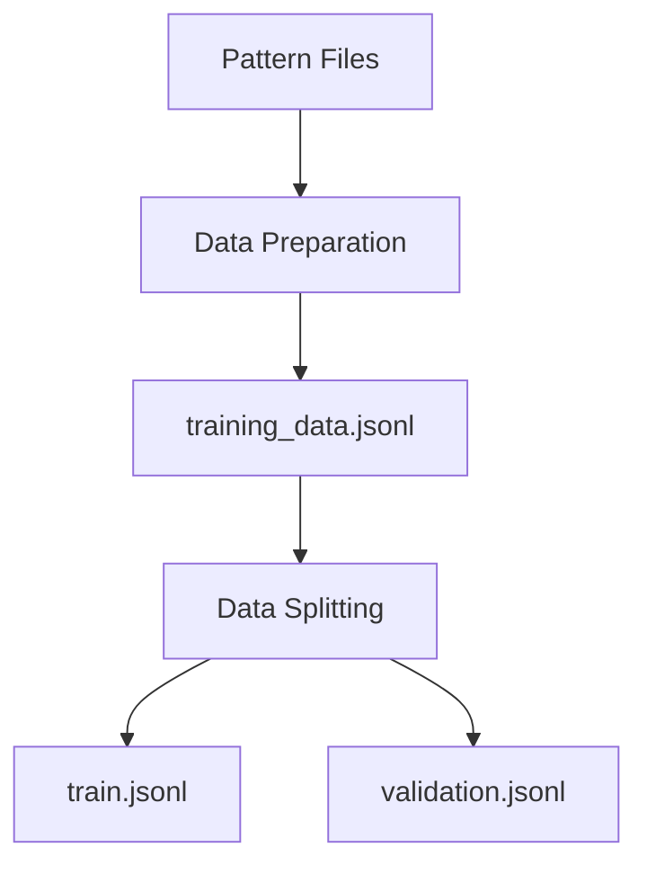

# Pipeline Architecture

This document outlines the architecture of the GLIMMER Pattern Pipeline, including its components and data flow.

## Components

### 1. Pattern Files (`glimmer/data/patterns/`)
- JSON files following the GLIMMER schema
- Each file represents a single pattern with metadata and content
- Naming convention: `{number:04d}-{descriptive_name}.json` (e.g., `0001-GLIMMER.json`)

### 2. Data Preparation (`scripts/prepare_lora_data.py`)
- Loads and validates pattern files
- Converts patterns into instruction-following format
- Outputs a single JSONL file with training examples

### 3. Data Splitting (`scripts/split_data.py`)
- Splits the processed data into training and validation sets
- Maintains the ratio specified (default: 80/20 split)
- Ensures consistent splits with a fixed random seed

### 4. Output Files (`data/processed/`)
- `training_data.jsonl`: All processed examples
- `train.jsonl`: Training examples
- `validation.jsonl`: Validation examples

## Data Flow



## File Structure

```
PLUTO/
├── glimmer/
│   └── data/
│       └── patterns/         # Input pattern files
│           ├── 0001-GLIMMER.json
│           ├── 0002-*.json
│           └── ...
├── scripts/
│   ├── prepare_lora_data.py  # Data preparation script
│   └── split_data.py         # Train/val split script
└── data/
    └── processed/            # Output directory
        ├── training_data.jsonl
        ├── train.jsonl
        └── validation.jsonl
```

## Configuration

Key parameters that can be adjusted:

1. **Data Preparation**
   - `--patterns-dir`: Directory containing pattern files
   - `--output-dir`: Output directory for processed data

2. **Data Splitting**
   - `--input-file`: Path to the processed JSONL file
   - `--output-dir`: Output directory for splits
   - `--train-ratio`: Ratio of data to use for training (0-1)
   - `--seed`: Random seed for reproducibility

[Next: Adding New Patterns →](adding_patterns.md)
